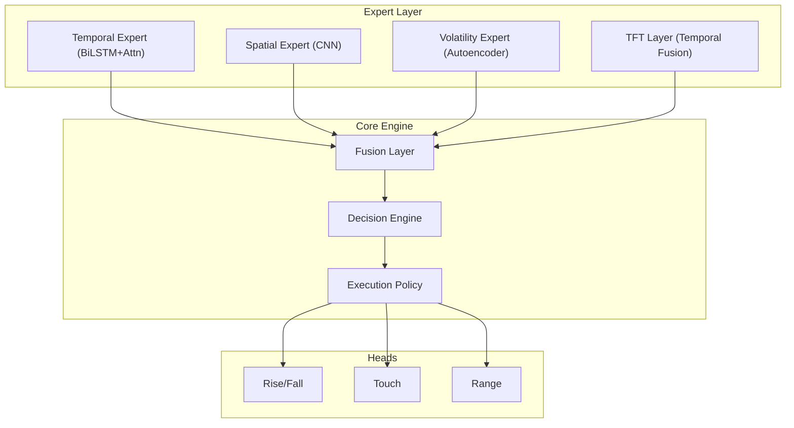

# x.titan - Advanced Multi-Expert Trading System

A professional, modular deep learning system for high-frequency binary options trading on Deriv.com, featuring a multi-expert architecture and a robust safety-first execution engine.

## 🏗️ Architecture



## 🚀 Key Features

*   **Multi-Expert Model**: Combines BiLSTM (Temporal), CNN (Spatial), Autoencoders (Volatility), and Temporal Fusion Transformers (TFT) for specialized market analysis.
*   **Advanced Execution Engine**:
    *   **Market Regime Detection**: Dynamic adaptation to changing market conditions (Regime V2).
    *   **Position Sizing**: Smart capital allocation based on signal confidence and risk profiles.
    *   **Adaptive Risk**: Real-time adjustment of barriers and take-profit/stop-loss levels.
*   **Safety & Reliability**:
    *   **Circuit Breakers**: Multi-tier protection against volatility and rapid losses.
    *   **Daily Loss Limits**: Automatic hard stops to protect capital.
    *   **Idempotency**: Robust trade execution tracking to prevent duplicate orders.
*   **Shadow Trading**: High-fidelity simulation tier for real-time strategy validation without financial risk.
*   **Observability**:
    *   **Live Dashboard**: Real-time monitoring of trades, signals, and system health.
    *   **Detailed Analytics**: HTML shadow reports and performance tracking over time.

## 🛠️ Quick Start

### 1. Prerequisites
*   Python 3.10+
*   TA-Lib (system library)

### 2. Install Dependencies
```bash
# Install TA-Lib (Ubuntu/Debian)
./scripts/install-talib.sh

# Setup Virtual Environment
python -m venv venv
source venv/bin/activate
pip install -r requirements.txt
```

### 3. Configuration
Copy `.env.example` to `.env` and configure your credentials:
```bash
DERIV_API_TOKEN=your_token_here
TRADING__SYMBOL=R_100
```

### 4. Core Workflow
| Step | Command |
| :--- | :--- |
| **Download Data** | `python scripts/download_data.py --months 24` |
| **Train Model** | `python scripts/train.py --epochs 50` |
| **Shadow Mode** | `python scripts/live.py --shadow` |
| **Live Trading** | `python scripts/live.py --checkpoint best_model` |

## 📂 Project Structure

For a deep dive into the architecture and data flow, see the [Comprehensive Architecture Blueprint](file:///home/planetazul3/x.titan/docs/architecture.md).

```text
x.titan/
├── api/                # Dashboard Backend (FastAPI, Auth, WebSockets)
├── config/             # System Settings (Logging, Constants, Env)
├── data/               
│   ├── ingestion/      # Historical Downloader & Integrity Checks
│   ├── features.py     # Signal Engineering
│   └── dataset.py      # PyTorch Multi-task Datasets
├── execution/          
│   ├── decision.py     # Signal Aggregation & Thresholds
│   ├── policy.py       # Safety Profile & Circuit Breakers
│   ├── regime_v2.py    # Market State Detection
│   └── shadow_store.py # Persistent Simulation Logic
├── models/             
│   ├── core.py         # DerivOmniModel (Expert Fusion)
│   ├── tft.py          # Temporal Fusion Transformer
│   └── (spatial/temporal/volatility) # Expert Neural Nets
├── observability/      # Execution Logging & Performance Metrics
├── training/           # Training Loops, Multi-task Losses, & RL
├── scripts/            # CLI Tools (Live, Train, Download, Evaluate)
├── dashboard/          # React/Vite/Tailwind Frontend
├── checkpoints/        # Saved Model Weights (.pt)
└── data_cache/         # SQLite DBs & Local Parquet Storage
```

## 📊 Observability & Reporting
*   **Dashboard**: Run `npm run dev` in the `dashboard/` directory.
*   **Shadow Reports**: `python scripts/generate_shadow_report.py` to generate visual performance audits.

## ⚖️ License
MIT

