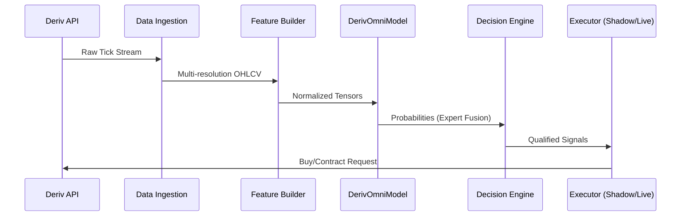

# x.titan - Technical Architecture Blueprint

This document provides a comprehensive technical map of the **x.titan** project. It is designed to give another AI system (or senior developer) a full understanding of the project's logic, data flow, and structural dependencies without requiring the entire source code up front.

## 🎯 System Objective
**x.titan** is a high-frequency, multi-expert trading system for the Deriv.com binary options market. It uses deep learning (Transformers, BiLSTMs, CNNs) to predict price movements across multiple contract types (Rise/Fall, Touch, Range) with a heavy focus on safety, market regime awareness, and shadow-replay validation.

---

## 🏗️ Core Module Mapping

### 1. `execution/` (The Brain)
*Handles the transition from model predictions to market orders.*
- [decision.py](file:///home/planetazul3/x.titan/execution/decision.py): Aggregates expert signals and applies thresholds.
- [policy.py](file:///home/planetazul3/x.titan/execution/policy.py): Implements safety rules, circuit breakers, and execution logic.
- [adaptive_risk.py](file:///home/planetazul3/x.titan/execution/adaptive_risk.py): Dynamically adjusts trade parameters based on market volatility.
- [regime_v2.py](file:///home/planetazul3/x.titan/execution/regime_v2.py): Complex market state detection (Trending, Ranging, Volatile).
- [sqlite_shadow_store.py](file:///home/planetazul3/x.titan/execution/sqlite_shadow_store.py): Manages persistence for "Shadow Trades" (simulations).

### 2. `models/` (The Experts)
*Neural network architecture definitions.*
- [core.py](file:///home/planetazul3/x.titan/models/core.py): The main `DerivOmniModel` wrapper.
- [tft.py](file:///home/planetazul3/x.titan/models/tft.py): Temporal Fusion Transformer implementation.
- [temporal.py](file:///home/planetazul3/x.titan/models/temporal.py): BiLSTM with attention.
- [spatial.py](file:///home/planetazul3/x.titan/models/spatial.py): CNN for price geometry.
- [volatility.py](file:///home/planetazul3/x.titan/models/volatility.py): Variational Autoencoder (VAE) for anomaly detection.

### 3. `data/` (The Pipeline)
*From raw ticks to tensor-ready datasets.*
- [processor.py](file:///home/planetazul3/x.titan/data/processor.py): Feature engineering and signal generation.
- [ingestion/](file:///home/planetazul3/x.titan/data/ingestion/): Logic for API calls and parquet storage integrity.
- [dataset.py](file:///home/planetazul3/x.titan/data/dataset.py): PyTorch dataset classes for multi-task training.
- [normalizers.py](file:///home/planetazul3/x.titan/data/normalizers.py): Real-time scaling logic for inputs.

### 4. `training/` (The Optimizer)
- [trainer.py](file:///home/planetazul3/x.titan/training/trainer.py): Training loops with multi-task loss weighting.
- [online_learning.py](file:///home/planetazul3/x.titan/training/online_learning.py): Mechanisms for continuous model updates.
- [metrics.py](file:///home/planetazul3/x.titan/training/metrics.py): Specialized trading metrics (Sharpe, Profit Factor, Calibration).

### 5. `observability/` & `api/` & `dashboard/`
- **Observability**: Real-time logging of execution decisions and health.
- **API**: FastAPI backend providing trade history and health stats to the UI.
- **Dashboard**: React frontend for live monitoring.

---

## 🔄 Data Flow



---

## 🗄️ Persistence Layer

Stored in `data_cache/` using SQLite:
- `shadow_trades.db`: Tracks simulated trade outcomes for ROI calculation without risk.
- `safety_state.db`: Core metrics for circuit breakers (Daily Loss, Stake Limits).
- `idempotency.db`: Ensures no duplicate trades are placed during network instability.

---

## 🚀 Key Entry Points
- [scripts/live.py](file:///home/planetazul3/x.titan/scripts/live.py): The main production loop.
- [scripts/train.py](file:///home/planetazul3/x.titan/scripts/train.py): Local training entry.
- [scripts/backtest_run.py](file:///home/planetazul3/x.titan/scripts/backtest_run.py): Historical strategy validation.
- [main.py](file:///home/planetazul3/x.titan/main.py): Unified orchestrator (often used for experiments).

---

## 🛠️ Detailed File Tree (Mapped)

```
.
├── api/                    # Dashboard Backend
├── config/                 # YAML/Env Settings
├── data/
│   ├── ingestion/          # API Client & Integrity
│   └── (features/dataset)  # Preprocessing
├── execution/              # Decision Logic & Safety
├── models/                 # Neural Architectures
├── observability/          # Logging & Metrics
├── training/               # Training & RL Loops
├── scripts/                # CLI Tools
├── dashboard/              # React UI
├── checkpoints/            # Model Weights
├── data_cache/             # Databases & Parquet
└── tools/                  # Support Utilities
```
