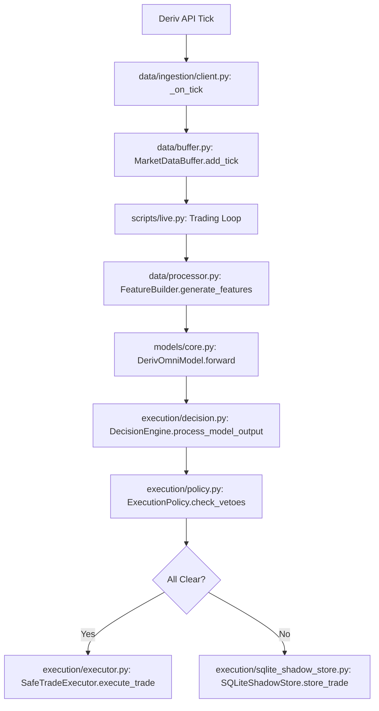

# DATA_FLOW_TRACE.md

## Critical Path Mapping

## Step-by-Step Validation

1. **Tick Ingestion**: `DerivClient` correctly handles WebSocket stream and passes data to buffer.
2. **Feature Engineering**: `FeatureBuilder` transforms raw ticks and candles into 3-tuple tensors (ticks, candles, vol_metrics).
3. **Inference**: `DerivOmniModel` fuses temporal (TFT), spatial (CNN), and volatility (VAE) features into contract probabilities.
4. **Decision**: `DecisionEngine` enforces hierarchical vetoes. 
    - **CRITICAL BREAK**: `scripts/live.py` fails to pass `model_monitor` to `run_live_trading`, breaking the chain at the decision stage during live monitoring setup.
5. **Persistence**: `SQLiteShadowStore` captures simulation context. Schema is validated to match current data shapes.

## Side Effects & Logging
- **Observability**: Prometheus metrics are updated at each stage (if enabled).
- **History**: Real trades are tracked in `real_trade_tracker.py` and persisted in `trading_state.db`.
