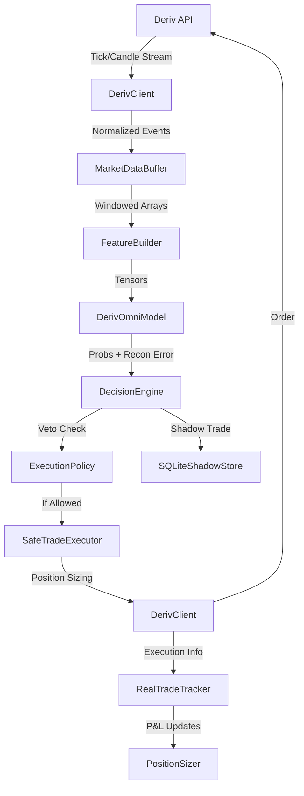

# DATA_FLOW_TRACE.md

## High-Level Data Journey

## Detailed Component Interactions

| Phase | Component | Action | Data Type |
|-------|-----------|--------|-----------|
| **Ingestion** | `DerivClient` | Async stream subscription | WebSocket JSON |
| **Buffering** | `MarketDataBuffer` | Accumulates history + live ticks | `np.ndarray` |
| **Feature Eng**| `FeatureBuilder` | Normalization (Z-score/Log) | `torch.Tensor` |
| **Intelligence**| `DerivOmniModel` | Multi-expert inference | `dict[str, Tensor]` |
| **Risk** | `ExecutionPolicy` | Hierarchy veto (Circuit Breaker/Regime) | `VetoDecision` |
| **Execution** | `SafeTradeExecutor`| Rate limiting & Stake validation | `Signal -> Contract` |
| **Persistence**| `SQLiteShadowStore`| Unified storage of all signals | `SQL Record` |

## Critical Observability Points

1. **Inference Latency**: Tracked in `run_inference`.
2. **Reconstruction Error**: Used as the primary signal for `RegimeVeto`.
3. **Veto Statistics**: Recorded by `ExecutionPolicy` for diagnostic reports.
4. **P&L Flux**: Tracked by `RealTradeTracker` via WebSocket contract updates.

## Identified Bottlenecks
- **Synchronous Inference**: Historically blocked the event loop. Refactored to use `run_in_executor` (thread pool) in `scripts/live.py`.
- **Database Commits**: ACID compliance in SQLite can slow down tick processing if not batched or asynchronous.
