# DEPENDENCY_MAP.md

## Module Dependency Graph (Subset of Key Relationships)

```mermaid
graph TD
    pre_training_validation --> models_tft
    pre_training_validation --> models_temporal_v2
    pre_training_validation --> data_auto_features
    pre_training_validation --> execution_rl_integration
    pre_training_validation --> config_settings
    tests_test_integration --> execution_integration
    tests_test_integration --> execution_regime_v2
    tests_test_integration --> execution_signals
    tests_test_dataset_alignment --> config_settings
    tests_test_dataset_alignment --> data_dataset
    tests_test_dataset_alignment --> data_features
    tests_verify_id002 --> execution_decision
    tests_test_h13_losses --> training_losses
    tests_test_trainer --> training_trainer
    tests_test_m07_spatial_pooling --> models_spatial
    tests_test_m07_spatial_pooling --> config_settings
    tests_test_sizer_concurrency --> execution_position_sizer
    tests_test_safety --> config_constants
    tests_test_safety --> execution_executor
    tests_test_safety --> execution_safety
    tests_test_safety --> execution_signals
    tests_test_dashboard --> observability_dashboard
    tests_test_checkpoint_manifest --> training_checkpoint_manifest
    tests_test_shadow_resolution_properties --> execution_shadow_resolution
    tests_test_shadow_resolution_properties --> execution_shadow_store
    tests_test_shadow_resolution_properties --> config_constants
    tests_test_rl_trainer --> models_policy
    tests_test_rl_trainer --> training_rl_trainer
    tests_test_m12_hot_reload --> models_core
    tests_test_m12_hot_reload --> config_settings
    tests_test_m15_targeted_retry --> execution_safety
    tests_test_m15_targeted_retry --> execution_executor
    tests_test_m15_targeted_retry --> config_constants
    tests_test_c01_verification --> execution_shadow_store
    tests_test_c01_verification --> execution_sqlite_shadow_store
    tests_test_c01_verification --> execution_shadow_resolution
    tests_test_c01_verification --> config_settings
    tests_test_c01_verification --> config_constants
    tests_test_tft --> config_settings
    tests_test_tft --> models_tft
    tests_test_h06_crash --> data_normalizers
    tests_test_h06_crash --> data_features
    tests_test_h06_crash --> config_settings
    tests_test_shadow_evaluation --> training_shadow_evaluation
    tests_test_backtest --> execution_backtest
    tests_test_m08_input_dims --> config_settings
    tests_test_m08_input_dims --> models_temporal
    tests_test_regime_v2 --> execution_regime_v2
    tests_test_h01_sizing --> execution_executor
    tests_test_h01_sizing --> config_settings
```

## Circular Dependencies Detected
- ❌ data.dataset -> data.features -> data.processor -> data -> data.dataset
- ❌ data.features -> data.processor -> data -> data.features
- ❌ data.dataset -> data.features -> data.processor -> data -> data.loader -> data.dataset
- ❌ data.features -> data.processor -> data -> data.shadow_dataset -> data.features

## Orphaned Modules (No incoming references within documented core)
- test_log
- pre_training_validation
- python-deriv-api.setup
- python-deriv-api.tests.test_utils
- python-deriv-api.tests.test_cache
- python-deriv-api.tests.test_in_memory
- python-deriv-api.tests.test_errors
- python-deriv-api.tests.test_deriv_api
- python-deriv-api.tests.test_subscription_manager
- python-deriv-api.tests.test_custom_future
- python-deriv-api.tests.test_middlewares
- python-deriv-api.tests.test_deriv_api_calls
- python-deriv-api.build.lib.deriv_api.cache
- python-deriv-api.build.lib.deriv_api.streams_list
- python-deriv-api.build.lib.deriv_api.middlewares
- python-deriv-api.build.lib.deriv_api.subscription_manager
- python-deriv-api.build.lib.deriv_api.deriv_api
- python-deriv-api.build.lib.deriv_api.easy_future
- python-deriv-api.build.lib.deriv_api.in_memory
- python-deriv-api.build.lib.deriv_api.deriv_api_calls
- python-deriv-api.build.lib.deriv_api.errors
- python-deriv-api.build.lib.deriv_api
- python-deriv-api.build.lib.deriv_api.utils
- python-deriv-api.examples.simple_bot2
- python-deriv-api.examples.example_1_auth_balance
- python-deriv-api.examples.example_3_buy_contract
- python-deriv-api.examples.simple_bot1
- python-deriv-api.examples.simple_bot4
- python-deriv-api.examples.example_2_tick_stream
- python-deriv-api.examples.simple_bot3
- python-deriv-api.deriv_api.cache
- python-deriv-api.deriv_api.streams_list
- python-deriv-api.deriv_api.middlewares
- python-deriv-api.deriv_api.subscription_manager
- python-deriv-api.deriv_api.deriv_api
- python-deriv-api.deriv_api.easy_future
- python-deriv-api.deriv_api.in_memory
- python-deriv-api.deriv_api.deriv_api_calls
- python-deriv-api.deriv_api.errors
- python-deriv-api.deriv_api
- python-deriv-api.deriv_api.utils
- tools.verify_checkpoint
- tools.unify_files
- tools
- tools.migrate_shadow_store
- tools.validation.benchmark_performance
- tools.validation.map_dependencies
- tools.validation.validate_functions
- tools.validation.validate_imports
- tools.validation.verify_behavior
- api
- api.services
- api.models
- models
- training.callbacks
- training
- training.auto_retrain
- scripts
- core.interfaces
- core
- core.domain
- data.ingestion.deriv_adapter
- execution
- config
- observability.live_shadow_comparison
- observability.performance_tracker
- utils

## External Dependencies Analysis
Check requirements.txt for versioning health.
